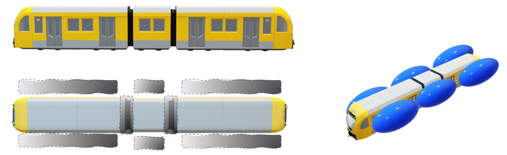

# TRAINS ft. Azure Percept (The Railway AI protectioN System)
Return Hometown Safely

## Project Members (alphabetical order)

1. Anne Yang (Advisor) - Group Engineering Manager
2. Cheryl Hsu (Advisor) - Program Manager
3. Connor Chuang (Hacker) - Mechanical Engineer
4. Devin Wong (Hacker) - Software Egnineer
5. LeAnn Huang (Hacker) - Software Engineer
6. Isaac Ho (Hacker) - Eletrical Engineer

## Motivation
On 2 April 2021, a Taroko Express train derailed at the north entrance of Qingshui Tunnel in Taiwan, killing 49 people and injuring at least 200 others. These people wanted home to visit relatives because of the Spring Festival holiday, but they and their family could not reunite forever. And this was the second major and serious derailment accident in Taiwan over the last two years. We are eager to address this problem to save more lives. 

We have found that such tragedies continue to occur all over the world, and train derailment occurs more frequently than we thought. There have been over 500 train accidents with fatalities and injuries over the past decades. Recently, there was a train derailment that killed 3, injured over 50 in Washington State on 2021/9/27. From 2010 to 2021 decade, there were 2429 deaths, 12,355 injuries caused by railway derailments. We provide solutions to protect train passengers.

## Impact
There are many injuries and deaths caused by derailment resulting in the anomaly object in the rail can be completely prevented through the anomaly detection by Azure Percept Devkit and drone. And through the motor-activated airbag device, the collision force level can be reduced to 70%, and send the information and notification in a timely manner. 

We hope that all passengers can take the train at ease, arrive at the destination on schedule, and reunite with their family and friends. If you agree with our idea and project, please “like” our project to make this topic more widely cared and discussed, and the relevant organizations can take the actions to protect the safety of you, me and the passengers.

## HOW IT WORK
We provide solutions to protect train passengers from two aspects 

1. Proactive precaution

This sub-system provides proactive precaution so that the anomaly can be eliminated as early as possible. We set up Azure Percept Devkit above the tunnel entrance (the number of deaths and injuries is particularly serious if derailment happens in a tunnel hitting the tunnel wall), and perform Anomaly Detection through Azure Percept Vision. If an anomaly object is detected, Azure Percept Devkit will send a signal to activate the warning light to notify the conductor to brake. For the location out of the stationary Azure Percept Devkit detected range, we use drones along the rails to detect anomaly objects and do the actions accordingly. 
 
2. Proactive Protection

This sub-system provides proactive protection and follow-up remedies if there is not enough time to stop a collision. If the distance between the train and the anomaly object is not long enough for the train to make a fully stop, the system will not only notify the conductor to brake, but also automatically control the motor inflates the airbag in order to alleviate the collision force to the train and passenger. Meanwhile, the system will report directly to 911 iIf Azure Percept Audio detects anomalous sounds such as collision, explosion, crying, siren. In addition, the information such as train acceleration, time, path, anomalous sound, and train collision video stream will be sent to the dashboard for the center console through IoT Hub and Azure Video Analyzer for people who monitor the rail to get the latest information of the accident and provide the best support.  

## Solution Architecture

## Reference
1. [2021 Hualien train derailment wikipedia](https://en.wikipedia.org/wiki/2021_Hualien_train_derailment)
2. [List of rail accidents](https://en.m.wikipedia.org/wiki/List_of_rail_accidents_(2010–2019))
3. [Train collision dynamic model considering longitudinal and vertical coupling](https://journals.sagepub.com/doi/full/10.1177/1687814018823966)