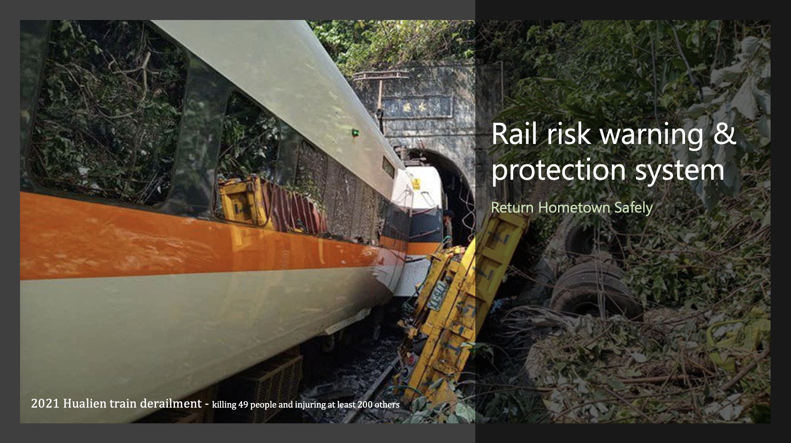
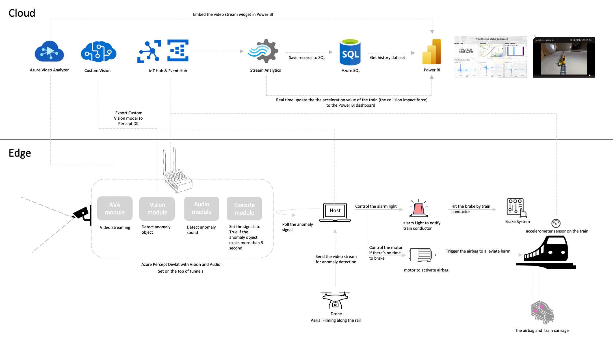
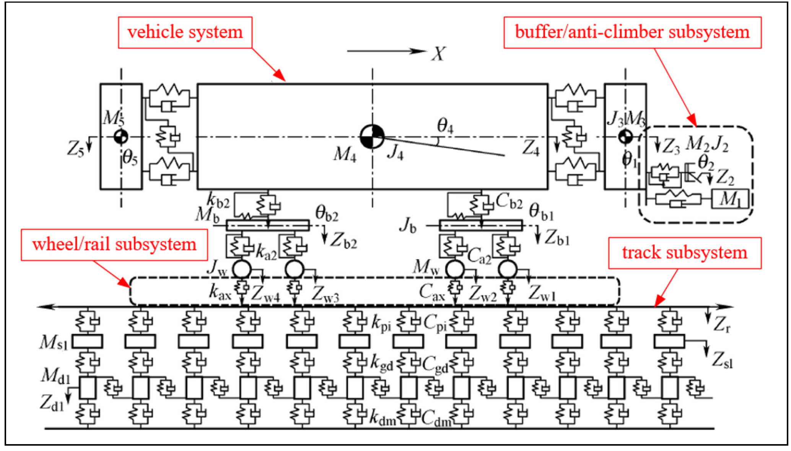

# rail-risk-warning-protection-system
Return Hometown Safely

# Scenario
On 2 April 2021, at 09:28 NST (01:28 UTC), a Taroko Express train operated by the Taiwan Railways Administration (TRA) derailed at the north entrance of Qingshui Tunnel in Heren Section, Xiulin Township, Hualien County, Taiwan, killing 49 people and injuring at least 200 others. At the time of the accident, the train was carrying 494 passengers. The eight-carriage train derailed after colliding with a construction truck that had fallen down a slope onto the tracks north of Hualien City, and came to rest in the tunnel, with severe damage and many casualties.

The topics toward rail safety issue has been widely discussed after the 2021 Hualien train derailment accident.

# Solution Architecture

# Absorber Component

The basic collision dynamics coupling model of the vehicle