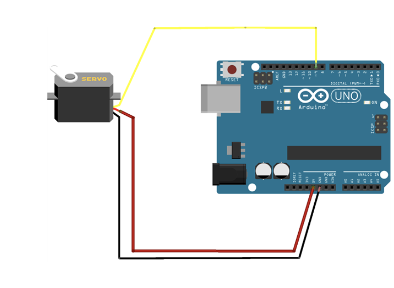
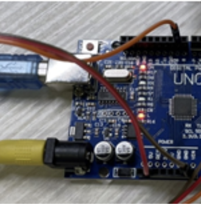

## Arduino for motor control  
Use Arduino UNO R3 to control the servo motor MG996R

### Diagram

## Connection
| Motor            | Arduino                                                 |
|-------------------------|---------------------------------------------------------------|
| `PWM (Orange line)`     | Pin 9   |
| `V+ (Red line)`     | 5V    |
| `GND (Brown Line)`     | GND    |

### Set up for motor

1. Connect the MG996R to Arduino as the connection table above.  

2. Plug the DC adapter to the DC jack on Arduino board, and connect the USB cable between Arduino and PC. The input voltage of DC jack should be 9V-12V 

1. Upload the code servo.ino into the Arduino 

2. Reset the Arduino 

3. Motor will rotate clockwise for 130 degrees, then rotate anticlockwise for 150 degrees. 